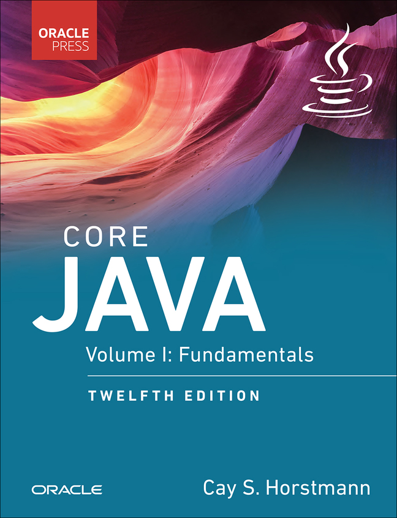

<!-- _class: lead -->

<!-- _header: M1 Informatique • Pré-rentrée 2022 • Programmation Java -->

# Introduction

 

Thibaud Martinez 
thibaud.martinez@dauphine.psl.eu

<!-- _footer:  -->

---

## Objectifs

* Se familiariser avec la syntaxe Java et être capable de réaliser des programmes simples;
* comprendre les concepts de base de la programmation orientée objet;
* apprivoiser les outils de la plateforme Java et découvrir la bibliothèque standard.

---

## Prérequis

* Une précédente expérience avec un langage de programmation (C, C++, Python, PHP, VBA, etc.);
* une précédente expérience avec un système d'exploitation (UNIX de préférence);
* de la motivation.

---

L'ouvrage de référence pour ce cours est [**Core Java, Volume I: Fundamentals, 12th Edition** par *Cay Horstmann*](https://horstmann.com/corejava/).

---

## Plan

* Chapitre 1 - **Structures de programmation de base (1)**
* Chapitre 2 - **Structures de programmation de base (2)**
* Chapitre 3 - **Objets et classes**
* Chapitre 4 - **Héritage**
* Chapitre 5 - **Exceptions**
* Chapitre 6 - **Généricité**
* Chapitre 8 - **Collections**

---

## Conventions de présentation

* :information_source: matérialise une remarque
* :warning: signale un point d'attention
* :boom: indique la survenance d'une erreur
* :sparkles: fait référence à une pratique de programmation recommandée

 

Les liens vers les sources sont situés en pied de page.

---

## Java, un historique

* Créé à _Sun Microsystems_ par une équipe menée par **James Gosling**.
* Première version publiée en 1996.
* _Sun Microsystems_ est rachetée en 2009 par _Oracle_ qui détient et maintient désormais Java.
* [OpenJDK](https://openjdk.org/) est une implémentation _open source_ de Java. Depuis Java SE 7 en 2011, c'est l'[implémentation de référence](https://jdk.java.net/java-se-ri/7).
* [Java SE 18](https://jdk.java.net/18/) est actuellement la version la plus récente.

---

## Principes

Plus qu'un language, est une plateforme de programmation comprenant des bibliothèques logicielles et un environnement d'exécution, construite autour de 11 principes.

 

    <ol type="1">
        <li>Simple</li>
        <li>Orienté-objet</li>
        <li>Distribué</li>
        <li>Robuste</li>
        <li>Sécurisé</li>
        <li><em>Architecture-Neutral</em></li>
    </ol>

    <ol type="1" start="7">
        <li>Portable</li>
        <li>Interprété</li>
        <li>Haute-performance</li>
        <li><em>Multithreaded</em></li>
        <li>Dynamique</li>
    </ol>

<!-- _footer: '[The Java Language Environment: A White Paper](https://www.oracle.com/java/technologies/language-environment.html)' -->

---

## Fonctionnement

* Le code source est d'abord écrit dans des fichiers textes se terminant par l'extension `.java`.

* Ces fichiers sources sont ensuite compilés en fichiers `.class` par le compilateur `javac`. Ceux-ci contiennent ne contient pas le code natif du processeur, mais des _bytecodes_, une représentation intermédiaire pour la machine virtuelle Java (JVM).

* Le lanceur `java` exécute ensuite l'application avec une instance de la machine virtuelle Java.

<!-- _footer: '[About the Java Technology](https://docs.oracle.com/javase/tutorial/getStarted/intro/definition.html)' -->

---

## Pourquoi apprendre Java en 2022 ?

* 3e language le plus populaire au monde selon l'[index TIOBE](https://www.tiobe.com/tiobe-index/).

* [Un nombre important de grandes entreprises utilise Java](https://stackshare.io/java) (Google, AirBnb, BNP Paribas...)

* L'écosystème Java est mature et très fourni.

* Le langage [continue d'évoluer et se modernise](https://advancedweb.hu/a-categorized-list-of-all-java-and-jvm-features-since-jdk-8-to-18/).

---

> _"There are only two kinds of languages: the ones people complain about and the ones nobody uses."_
> 
> **Bjarne Stroustrup**, créateur de C++

---

## Le jargon Java

| Nom                            | Description                                                                                                                                                               |
|--------------------------------|---------------------------------------------------------------------------------------------------------------------------------------------------------------------------|
| Java Development Kit (JDK)     | Pour développer des programmes Java.                                                                                                                                      |
| Java Runtime Environment (JRE) | Pour exécuter des programmes Java, ne contient pas les outils de développement.                                                                                           |
| Standard Edition (SE)          | La plateforme Java pour les ordinateurs classiques et les serveurs.                                                                                                       |
| HotSpot                        | Un compilateur _just-in-time_ développé par Oracle.                                                                                                                       |
| Long Term Support (LTS)        | Une version de Java maintenue pendant plusieurs années, contrairement aux versions publiées  tous les 6 mois qui servent à mettre en avant les nouvelles fonctionnalités. |

---

## Installation

* On utilisera **OpenJDK 17** qui implémente Java SE 17 (une version LTS), avec le compilateur HotSpot.

* Il existe plusieurs distributions (_builds_) d'OpenJDK.

* On recommande l'installation de la distribution [Adoptium Eclipse Temurin 17](https://adoptium.net/temurin/releases?version=17) disponible sur [adoptium.net](https://adoptium.net/).

:warning: Pour pouvoir exécuter les binaires Java sans avoir à utiliser le chemin complet vers ceux-ci, il faut [ajouter le répertoire des binaires à la variable d'environnement `PATH`](https://docs.oracle.com/javase/tutorial/essential/environment/paths.html).

<!-- _footer: '[Which Version of JDK Should I Use?](https://whichjdk.com/)' -->

---

## JShell

* Java Shell (JShell) est un outil interactif pour la programmation Java . 

* JShell est une boucle **_read-eval-print_** (REPL), qui évalue les déclarations, les instructions et les expressions au fur et à mesure de leur saisie et affiche immédiatement les résultats.

* Bien que son fonctionnement diffère légérement du mode d'exécution classique, il s'agit d'un outil pratique pour tester des fonctionnalités du langage et prototyper.

<!-- _footer: '[Introduction to JShell](https://docs.oracle.com/javase/9/jshell/introduction-jshell.htm)' -->