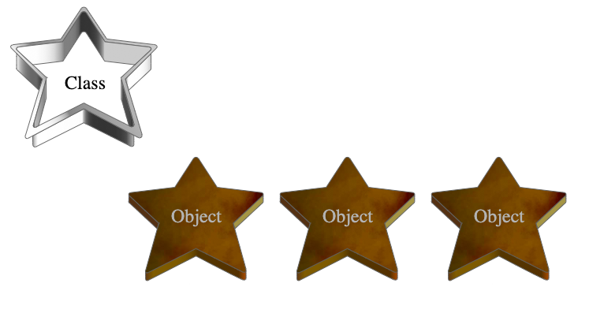

<!-- _class: lead -->

<!-- _header: M1 Informatique • Pré-rentrée 2022 • Programmation Java -->

## Chapitre 3
# Objets et classes

<br>

Thibaud Martinez 
thibaud.martinez@dauphine.psl.eu

<!-- _footer:  -->

---

## Quelques paradigmes de programmation

* **Programmation impérative:** basée sur les séquences d'instructions exécutées par l'ordinateur pour modifier l'état du programme (Fortran, C...).

* **Programmation fonctionnelle**: construit le programme par application et composition de fonctions mathématiques (Lisp, Haskell...).

* **Programmation orientée objet**: basée sur le concept d'_"objets"_, des entités contenant à la fois des instructions et des données (Smalltalk, Java...).

:warning: Nombreux sont les langages "multi-paradigmes" qui utilisent des concepts issus de différents paradigmes.

<!-- _footer: '[Van Roy, P., 2009. Programming paradigms for dummies: What every programmer should know. <br>New computational paradigms for computer music, 104, pp.616-621.](http://www.sm.luth.se/csee/courses/timber/reading/VanRoy.pdf)' -->

---

## Programmation orientée objet

* Repose sur la définition et l'interaction de "briques" appelées objets.

* Un objet représente **un concept, une idée ou une entité du monde physique**. 

* Chaque objet possède un **comportement**, exposée à ses utilisateurs, et une **structure** interne cachée.

* L'interaction entre les objets via leurs **relations** permet de concevoir et réaliser les fonctionnalités du programme.

➞ Java a d'abord été conçu comme un langage orienté objet. Avec le temps, il intègre de plus en plus de fonctionnalités de programmation fonctionnelle.

---

## Classes

Une **classe** spécifie comment les objets sont fabriqués. 

On peut voir les classes comme des moules à biscuits ; les objets sont les biscuits eux-mêmes. Lorsque vous construisez un objet à partir d'une classe, on dit que vous avez créé une **instance de cette classe**.



---

## Déclarer une classe

```java
public class Voiture {

}
```

<br>

:information_source: On verra dans les slides suivants la signification du mot-clé `public`.

:sparkles: Le nom des classes doit être en [_PascalCase_](https://www.oracle.com/java/technologies/javase/codeconventions-namingconventions.html).


---

## Déclarer des variables d'instance

```java
public class Voiture { 
    String marque;      
    String modele;
    String couleur;
    int annee;
    int vitesse;
}
```

Les **variables d'instances** ou **attributs** sont des variables qui contiennent l'**état des objets**.

---

## Définir des méthodes

```java
public class Voiture {
    // ...
    int vitesse;

    void accelerer(int nouvelleVitesse) {
        System.out.println("Vroooom !");
        vitesse = nouvelleVitesse;
    }
}
```

Les méthodes définissent le **comportement** des objets.

Méthodes et variables constituent les **membres** de la classe.

---

## Constructeurs

<style scoped>
p, li {
    font-size: 0.9rem
}

code {
    font-size: 0.8rem
}

</style>

Un constructeur est une méthode spéciale qui est utilisée pour **initialiser les objets**.

```java
public class Voiture {
    String marque;      
    int vitesse;

    Voiture(String m) {
        marque = m;
        vitesse = 0;
    }
}
```

* Le nom du ou des constructeurs doit correspondre au **nom de la classe**.
* Les constructeurs n'ont pas de **type de retour**.
* Si aucun constructeur n'est déclaré, la classe aura un **constructeur par défaut**. Celui-ci ne prend pas d'argument et initialise les attributs à leurs valeurs par défaut.

---

## Création d'objets

### Déclaration

```java
Voiture voiture;
```

### Initialisation

```java
voiture = new Voiture("Toyota");
```

### Déclaration et initialisation

```java
Voiture voiture = new Voiture("Toyota");
```

---

## Utilisation des objets

### Accéder aux attributs d'un objet

```
<reference de l'objet>.<nom de l'attribut>
```

```java
voiture.marque
```


### Appel des méthodes d'un objet

```
<reference de l'objet>.<nom de la méthode>(<arguments>)
```

```java
voiture.accelerer(110)
```

---

## _null_

Une variable objet contient une référence vers un objet.

La valeur `null` pour indiquer que la variable ne référence aucun objet.

```java
Voiture voiture =  null;
```

<br> 

:warning: On évitera tant que possible l'utilisation de `null`. Cette valeur peut être à l'origine de nombreux problèmes car tenter d'accéder d'appeler une méthode ou à un attribut d'une variable contenant `null` mènera à une erreur.

```java
Voiture voiture = null;
voiture.accelerer(1);   // NullPointerException
```

→ Pour en savoir plus : [Null References: The Billion Dollar Mistake](https://www.infoq.com/presentations/Null-References-The-Billion-Dollar-Mistake-Tony-Hoare/)

---

## _this_

Le mot-clé `this` fait référence à **l'objet courant** dans une méthode ou un constructeur.

Un usage courant de `this` est d'éliminer la confusion entre les attributs d'un objet et les paramètres portant le même nom. 

```java
public class Voiture {
    String marque;      

    Voiture(String marque) {
        this.marque = marque;
    }
}
```

---

<style scoped>
code {
    font-size: 0.8rem
}
</style>

## Membres _static_

Les variables d'instances sont propres à un objet donné et les méthodes agissent sur l'état de cet objet.

Le mot-clé `static` permet de créer des **variables de classes**. Ces variables appartiennent à la classe et existent donc en un unique exemplaire.

```java
static int variableDeClasse = 42;
```

On peut également créer des **méthodes de classes** ou **méthodes statiques**. Ces méthodes ne nécessitent un objet instancié pour être appelées. Elles peuvent agir sur les variables de classe.

```java
static void methodeStatique() {}
```

---

```java
class Voiture {
    static int nombre = 0;

    static void enregistrerVoiture() { nombre++; }
    static void compterVoitures() { 
        System.out.printf("%d voitures en circulation\n", nombre);
    }

    Voiture() { enregistrerVoiture(); }
}

public class Programme {
    public static void main(String[] args) {
        var v1 = new Voiture();     // Voiture.nombre vaut 1
        var v2 = new Voiture();     // Voiture.nombre vaut 2
        Voiture.compterVoitures();  // Affiche "2 voitures en circulation"
    } 
}
```

---

## _Packages_

En Java, toute instruction se trouve dans une **classe**. Le code de la classe se trouve dans un fichier source nommé `<nom de la classe>.java`

Pour faciliter la recherche et l'utilisation des types, pour éviter les conflits de noms et pour contrôler l'accès, on **regroupe les classes apparentées dans des packages**.

<br>

:information_source: Un _package_ définit un **espace de nom**. Ainsi, deux classes peuvent avoir le même nom si elle se trouvent dans des packages différents.

---

### Créer un _package_

<style scoped>
code {
    font-size: 0.8rem;
}
</style>

Pour créer un _package_ `geometrie` pour rassembler des classes modélisant des formes géométriques, on indique `package geometrie;` **en haut de chaque fichier source** faisant partie du _package_.

```java
// dans le fichier Carre.java
package geometrie;
public class Carre {}
```

```java
// dans le fichier Rectangle.java
package geometrie;
public class Rectangle {}
```

```java
// dans le fichier Cercle.java
package geometrie;
public class Cercle {}
```

---

### _Packages_ et arborescence de fichiers

On met les fichiers classes dans un **répertoire** dont le nom reflête le **nom du package** auquel les classes appartiennent.

```
geometrie
├── Carre.java
├── Cercle.java
└── Rectangle.java
```

---

### Convention de nommage des _packages_

Par convention, une entreprise utilise son **nom de domaine Internet inversé** pour les noms de ses _packages_.

Ainsi, la société **Example**, fera précéder tous ses noms de paquets de `com.example`. 

Une classe `Rectangle.java` appartenant au _package_ `com.example.geometrie` sera contenue dans la série de sous-répertoires suivante :

```
com/example/geometrie/Rectangle.java
```

---

### Utiliser les classes d'un package 

Pour utiliser les classes d'un _package_ depuis l'extérieur du _package_, on peut :

1. faire référence à la classe en utilisant son **_fully qualified name_**

```java
geometrie.Rectangle rect = new geometrie.Rectangle(); 
```

2. importer **spécifiquement la classe**

```java
import geometrie.Rectangle;     // en haut du fichier
Rectangle = new Rectangle();
```

3. importer un **_package_ entier** (toutes les classes du _package_)

```java
import geometrie.*;
Rectangle = new Rectangle();
Cercle = new Cercle();
```

---

:sparkles: **On évitera d'utiliser l'import _wildcard_ (*)**. Quand les imports se multiplient, il devient difficile d'identifier quel _package_ est responsable de quelle classe.

---

### Imports par défaut

Pour des raisons de commodité, le compilateur Java **importe automatiquement** deux _packages_ entiers pour chaque fichier source : 
1. le _package_ [`java.lang`](https://docs.oracle.com/javase/7/docs/api/java/lang/package-summary.html?is-external=true)
2. le _package_ du fichier courant

<br>

:information_source: C'est pour cette raison qu'il est possible d'utiliser `String` ou `System.out` sans avoir à se soucier des imports.

---

<style scoped>
code {
    font-size: 0.8rem
}
</style>

## Contrôler les accès aux membres d'une classe

Les **modificateurs de niveau d'accès** déterminent si d'autres classes peuvent utiliser un attribut particulier ou appeler une méthode particulière.

### Au niveau de la classe

* Une classe déclarée avec le **modificateur `public`** est utilisable n'importe où par toutes les autres classes.

```java
public class ClassePublique {}
```

* Si une classe n'a **pas de modificateur**, elle n'est visible que dans son propre package (_package-private_).

```java
class ClassePackagePrivate {}
```

---

<style scoped>
code {
    font-size: 0.8rem
}
</style>

### Au niveau des membres de la classe

* **`public`** : la variable ou méthode est visible n'importe où par toutes les autres classes.

```java
public int attributPublic;
public void methodePublique() {}
```

* **pas de modificateur (_package-private_)** : la variable ou méthode n'est visible que dans son propre package.

```java
int attributPackagePrivate;
void methodePackagePrivate() {}
```

* **`private`** : la variable ou méthode n'est visible que dans sa propre classe.

```java
private int attributPrive;
private methodePrivate() {}
```

---

## Encapsulation

C'est un concept clé de la programmation orientée objet. 

Il s'agit d'offrir à l'utilisateur de la classe, de l'objet ou du _package_ une **interface** pour manipuler cet élément tout en lui **masquant les détails d'implémentation**.

L'utilisateur interagit avec des "boites noires" dont il connaît le comportement mais pas le fonctionnement interne.

**L'encapsulation est clé pour la fiabilité et la maintenabilité d'un programme.**

Java encourage l'encapsulation grâce notamment à des fonctionnalités telles que les **modificateurs de niveau d'accès**.

---

## :sparkles: _Getters_ and _setters_

On souhaite que l'objet soit manipulé uniquement à travers ses méthodes.

```java
public class Personne {
    private String nom; // accès restreint

    // getter
    public String getNom() {
        return nom;
    }

    // setter
    public void setNom(String nom) {
        this.nom = nom; 
    }
}
```

---

Cela permet de faire évoluer la façon dont les données sont stockées en interne dans l'objet, sans modifier l'interface publique de l'objet et donc le code qui l'utilise.

```java
public class Personne {
    private String nomDeFamille;
    private String prenom;

    // getter
    public String getNom() {
        return prenom + " " + nomDeFamille;
    }

    // setter
    public void setNom(String nom) {
        String[] parts = nom.split(" ");
        this.prenom = parts[0];
        this.nomDeFamille = parts[1]; 
    }
}
```

---

## Stockage des données dans les variables

* **Types élémentaires** : la variable contient réellement les données.

* **Objets et tableaux (types références)** : la variable contient une **référence** vers l'adresse mémoire où se trouvent les données.

---

### Affectation et passage en argument de variables de type élémentaires

```java
public static void mtd(int n) {
    n = n + 1;
}
```

```java
int v1 = 10;
int v2 = v1;  // la valeur contenue dans v1 est copiée dans v2
v2 = 9; // v1 vaut toujours 10

mtd(v2);  // mtd opère sur une copie de v2
// v2 vaut toujours 9
```

---

### Affectation et passage en argument de variables de type référence

```java
class MonInt {
    int valeur;

    MonInt(int valeur) { this.valeur = valeur; }

    public static void donneLaValeur10(MonInt o) { o.valeur = 10; }
}
```

```java
var m1 = new MonInt(1); // m1 contient une référence vers l'objet.
var m2 = m1; // La référence est copiée, m2 pointe vers le même objet que m1.
m2.valeur = 2;  // Modifier m1 modifie m2, m1.valeur vaut 10.

MonInt.donneLaValeur10(m1);  // Une référence vers l'objet est passée à la méthode

// La méthode a modifié la valeur de l'objet.
// m1.valeur et m2.valeur valent 10.
```
