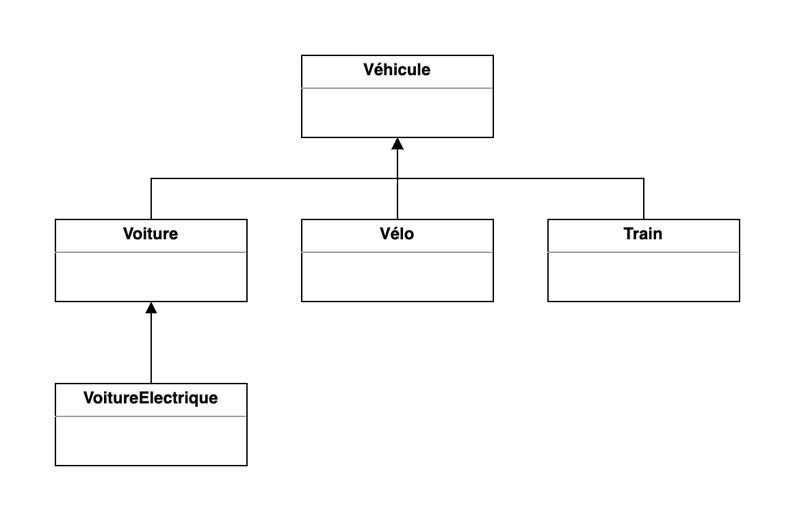

<!-- _class: lead -->

<!-- _header: M1 Informatique • Pré-rentrée 2022 • Programmation Java -->

## Chapitre 4
# Héritage

<br>

Thibaud Martinez 
thibaud.martinez@dauphine.psl.eu

<!-- _footer:  -->

---

## Le concept d'héritage

* L'héritage permet de créer de **nouvelles classes** qui sont construites sur des **classes existantes**.

* Lorsqu'on **hérite** d'une classe existante, on bénéficie (ou hérite) de ses **méthodes** et **attributs**.

* On peut ajouter de **nouvelles méthodes et de nouveaux attributs** pour adapter la nouvelle classe à de nouvelles situations.

→ La  relation **"est-un"** est la marque de l'héritage.

---

## Définir des sous-classes

```java
public class Voiture extends Vehicule {}
```

* Le mot-clé `extends` indique qu'on crée une nouvelle classe qui dérive d'une classe existante. 
* La classe existante est appelée **super-classe**, **classe de base** ou **classe parente**. 
* La nouvelle classe est appelée **sous-classe**, **classe dérivée** ou **classe enfant**.

---

## Ajouter des membres aux sous-classes

Les sous-classes ont plus de fonctionnalités que leurs super-classes.

```java
public class Vehicule {
    public void conduire() {
        // ...
    }
}

public class Voiture extends Vehicule {
    int niveauEssence;
    
    public void ajouterEssence() {
        // ...
    }
}
```

---

## Accéder aux membres de la super-classe

On peut accéder aux attributs et méthodes de la super-classe depuis la sous-classe.

```java
public class Vehicule {
    int vitesse;
}

public class Voiture extends Vehicule {
    public void tirerFreinAMain() {
        this.vitesse = 0;
    }
}
```

---

<style scoped>
p {
    font-size: 0.9rem;
}

code {
    font-size: 0.8rem;
}
</style>

## Redefinir des méthodes

Une sous-classe peut redéfinir des méthodes présentes dans sa super-classe pour les **spécialiser**.

```java
public class Vehicule {
    int vitesse;
    public void accelerer(int vitesse) { this.vitesse = vitesse; }
}

public class Voiture extends Vehicule {
    static int vitesseMax = 200;

    public void accelerer(int vitesse) {
        vitesse = vitesse < Voiture.vitesseMax ? vitesse : Voiture.vitesseMax;
        super.accelerer(vitesse);
    }
}
```

`super` est un mot clé spécial qui indique au compilateur d'**appeler la méthode de la super-classe**.

---

<style scoped>
p {
    font-size: 0.9rem;
}

code {
    font-size: 0.8rem;
}
</style>

## Constructeur dans les sous-classes

```java
public class Vehicule {
    String couleur;

    public Vehicule(String couleur) { this.couleur = couleur; }
}

public class Voiture extends Vehicule {
    int niveauEssence;

    public Voiture(String couleur) {
        // Appelle le constructeur de la super-classe "Vehicule"
        // avec l'argument "marque"
        super(couleur); 
        this.niveauEssence = 0;
    }
}
```

:warning: L'appel à `super` doit être la première déclaration dans le constructeur de la sous-classe.

---

## Hiérarchie de classes

* Les relations d'héritage définissent une **hierarchie de classes**.

* Ainsi, une classe donnée peut avoir une classe parente, une classe grande-parente, etc.

* En revanche, une classe ne peut hériter **que d'une seule classe**.



---

## Polymorphisme

Les variables référençant des objets sont **polymorphiques**. Une variable de type `Vehicule` peut faire référence à un objet de type `Voiture`. 


```java
public class Vehicule {}
public class Voiture extends Vehicule {}

Vehicule v;
v = new Vehicule();
v = new Voiture();
```

---

```java
public class Vehicule {
    public void afficheNom() {
        System.out.println("véhicule");
    }
}

public class Voiture extends Vehicule {
    public void afficheNom() {
        System.out.println("voiture");
    }
}

Vehicule v1 = new Vehicule();
Vehicule v2 = new Voiture();

v1.afficheNom();    // affiche "véhicule"
v2.afficheNom();    // affiche "voiture"
```

Lors de l'appel de la méthode, c'est bien la méthode de l'objet instancié qui est appelée.

---

## Accès protégé (_protected_)

Avec l'héritage, il existe un modificateur supplémentaire de niveau d'accès aux membres d'une classe : `protected`.

**`protected` spécifie que le membre ne peut être accédé qu'à l'intérieur de son propre package (comme avec private) et, en outre, par une sous-classe de sa classe dans un autre package.**

```java
public class Vehicule {
    protected String immatriculation;
}
```

---

## Modificateurs de niveau d'accès

### Au niveau de la classe

* **`public`** : n'importe où par toutes les autres classes.
* **pas de modificateur (_package-private_)** : que dans son propre package.
 

### Au niveau des membres de la classe

* **`public`** : n'importe où par toutes les autres classes.
* **pas de modificateur (_package-private_)** : que dans son propre package.
* **`protected`** : qu'à l'intérieur de son propre package et par une sous-classe de sa classe dans un autre package.
* **`private`** : que dans sa propre classe.

---

## Empêcher l'héritage (_final_)

On ne pourra **pas hériter** d'une classe déclarée comme `final`.

```java
public final class Chien {}
public class ChienMechant extends Chien {}  // Error: cannot inherit from final Chien
```

---

On peut également déclarer une méthode spécifique comme `final`.
La méthode ne pourra alors pas être redéfinie dans une sous-classe.

```java
public class Animal {
    String nom;

    public final void appeler() {
        System.out.println(this.nom + " !!!");
    }   
}
```

:boom: Le code ci-dessous ne compilera pas.
```java
public class Chien extends Animal {
    public void appeler() {
        System.out.println(this.nom + ", bon chienchien !");
    }   
}
```

---

## Classes abstraites

Une classe abstraite **ne peut pas être instanciée** mais des classes peuvent en hériter.

```java
public abstract class FormeGeometrique {
    
}
```


La raison d'être d'une classe abstraite est de fournir une **définition commune** d'une classe de base que plusieurs classes dérivées peuvent partager.

---

### Méthode abstraites

Une méthode abstraite est une méthode qui est déclarée **sans implémentation**.

```java
abstract void deplacer(int deltaX, int deltaY);
```

Si une classe comprend des méthodes abstraites, la classe elle-même doit être déclarée abstraite.

```java
public abstract class FormeGeometrique {
    abstract void deplacer(int deltaX, int deltaY);
}
```

Il appartient à la sous-classe d'**implémenter les méthodes abstraites**.

---

```java
public class Point extends FormeGeometrique {
    int x, y;

    void deplacer(int deltaX, int deltaY) {
        x += deltaX;
        y += deltaY;
    }
}

public class Triangle extends FormeGeometrique {
    Point s1, s2, s3;

    Triangle() {
        s1 = new Point();
        s2 = new Point();
        s3 = new Point();
    }

    void deplacer(int deltaX, int deltaY) {
        s1.deplacer(deltaX, deltaY);
        s2.deplacer(deltaX, deltaY);
        s3.deplacer(deltaX, deltaY);
    }
}
```

---

On peut ensuite déplacer toutes les formes géométriques de la même façon, sans avoir à se préoccuper de la nature exacte de celle-ci.

```java
FormeGeometrique forme1 = new Point();
FormeGeometrique forme2 = new Triangle();

forme1.deplacer(11, 12);
forme2.deplacer(-5, -4);
```

---

## Interfaces

On veut parfois manipuler des objets qui ont des fonctionnalités similaires mais pas de relation claire "est-un" entre eux.

On peut pour cela utiliser une interface. Une interface définit un **contrat**, un certain nombre de méthodes, que doit respecter un objet.

---

### Définir une interface

```java
public interface Nommable {
    void donnerUnNom(String nom);
}
```

On définit la signature des méthodes qui devront être implémentées par la classe implémentant l'interface. 

---

### Implémenter une interface

Une classe peut **implémenter** une interface, c'est-à-dire qu'elle indique satisfaire aux comportements spécifiés par l'interface.

Concrètement, cela veut dire que la classe fournit une implémentation pour les méthodes déclarées dans l'interface.

```java
class Personne implements Nommable {
    String prenom;
    String nomDeFamille;

    public void donnerUnNom(String nom) {
        String[] parts = nom.split(" ");
        this.prenom = parts[0];
        this.nomDeFamille = parts[1]; 
    }
}
```

---

Une classe peut implémenter plusieurs interfaces.

```java
class Personne implements Nommable, Cloneable {
    // implémentation des méthodes des interfaces
}
```

---

### Utiliser une interface en tant que type

Lorsqu'on crée une interface, on définit un nouveau type de données pour les variables.

```java
class Chien implements Nommable {
    String nom;

    public void donnerUnNom(String nom) {
        this.nom = nom;
    }
}

Nommable[] nommables = { new Personne(), new Chien(), new Chien() };

// On peut manipuler les objets sans se soucier de leur type concret,
// simplement en sachant qu'on peut leur donner un nom.
for (var n : nommables) {
    n.donnerUnNom("Sheridan Connolly");
}
```

---

### Étendre une interface

À la manière de l'héritage pour les classes, on peut `extends` une interface existante pour en définir une nouvelle plus spécialisée.

```java
public interface FaisLe {
   void faisQqchose(int i, double x);
}

public interface FaisLePlus extends FaisLe {
    int faisAutreChose(String s);
}

```

---

### Méthodes par défaut

Une interface peut définir des implémentations par défaut pour les méthodes grâce au mot-clé `default`.

```java
public interface Affichable {    
    default void afficher() {
        System.out.println("???");
    }
}

public class Personne implements Affichable {}

(new Personne()).afficher();  // affiche "???"
```

