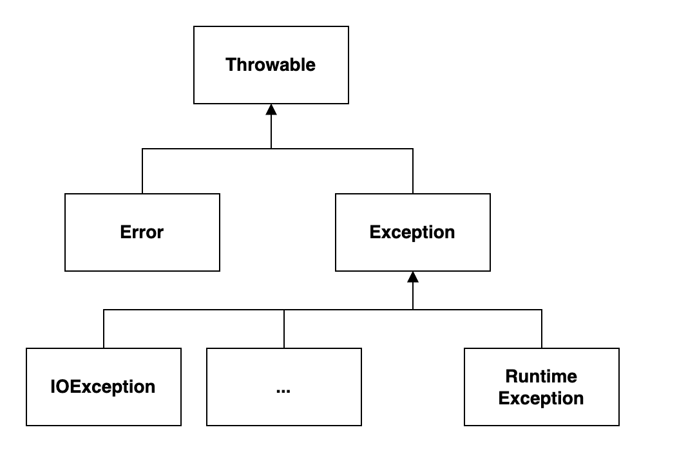

<!-- _class: lead -->

<!-- _header: M1 Informatique • Pré-rentrée 2022 • Programmation Java -->

## Chapitre 5
# Exceptions

<br>

Thibaud Martinez 
thibaud.martinez@dauphine.psl.eu

<!-- _footer:  -->

---

## Définition

Une exception est un événement qui se produit pendant l'exécution d'un programme et qui perturbe le déroulement normal des instructions du programme.

```java
int x = 1 / 0;  // Exception java.lang.ArithmeticException: / by zero
```

<br>

Par exemple,

* une erreur logique;
* un problème matériel;
* une entrée utilisateur inattendue;
* un manque de place sur le disque.

---

## Fonctionnement

Chaque méthode a une voie de sortie alternative si elle n'est pas en mesure d'accomplir sa tâche de manière normale.

* La méthode **lève une exception** : elle un crée un **objet** exception qui contient les informations relatives à l'erreur et le transmet au système d'exécution.
* Elle **ne renvoie pas de valeur** et son exécution est **interrompue**.
* Le mécanisme de gestion des exceptions commence à rechercher un **gestionnaire d'exception** capable de traiter cette erreur.


---

<style scoped>
p, li {
    font-size: 0.9rem
} 

</style>

## Hiérarchie des exceptions

Un objet exception est une instance d'une classe dérivée de `Throwable`.

* `Error` : extérieures à l'application et que l'application ne peut pas anticiper ou gérer.

* `Exception` :
    * `RuntimeException` : généralement causée par une erreur de programmation.
    * Toute autre exception qu'une application bien écrite doit anticiper et gérer.



---

## _Checked_ et _unchecked exceptions_

* **_unchecked exceptions_** : toute exception qui dérive de la classe `Error` ou de la classe `RuntimeException`;

* **_checked exceptions_** : toutes les autres exceptions.

Les _checked exceptions_ doivent obligatoirement être **gérées** par le programmeur dans le code. Le compilateur Java vérifie que c'est bien le cas. 

---

## Déclarer des _checked exceptions_

Une méthode n'indique pas seulement au compilateur Java les valeurs qu'elle peut renvoyer, elle lui indique également les exceptions qu'elle peut générer, avec le mot-clé `throws`. 

```java
public void leveUneException() throws Exception {}
public void levePlusieursException() throws FileNotFoundException, UnknownHostException {}
```
<br>

:warning: La méthode doit déclarer toutes les _checked exceptions_ qu'elle pourrait lever.

---

## Lever une exception

On crée un objet exception avec `new` et on lève l'exception avec `throw`.

```java
public boolean verifier(String utilisateur) throws Exception {
    if (utilisateur.equals("Bob")) {
        throw new Exception(
            "Je ne peux pas vérifier " + 
            "les autorisations de Bob"
        );
    }

    return true;
}
```

---

<style scoped>
p, li {
    font-size: 0.9rem;
} 
</style>

## Classes d'exceptions existantes

Il existe un certain nombre de classes d'exceptions prédéfinies dans la bibliothèque standard du langage.

* [`Clone­Not­Supported­Exception`](https://docs.oracle.com/en/java/javase/11/docs/api/java.base/java/lang/CloneNotSupportedException.html)
* [`Interrupted­Exception`](https://docs.oracle.com/en/java/javase/11/docs/api/java.base/java/lang/InterruptedException.html)
* [`Reflective­Operation­Exception`](https://docs.oracle.com/en/java/javase/11/docs/api/java.base/java/lang/ReflectiveOperationException.html)
* [`Runtime­Exception`](https://docs.oracle.com/en/java/javase/11/docs/api/java.base/java/lang/RuntimeException.html)
    * [`Arithmetic­Exception`](https://docs.oracle.com/en/java/javase/11/docs/api/java.base/java/lang/ArithmeticException.html)
    * [`Illegal­Argument­Exception`](https://docs.oracle.com/en/java/javase/11/docs/api/java.base/java/lang/IllegalArgumentException.html)
    * [`Index­Out­Of­Bounds­Exception`](https://docs.oracle.com/en/java/javase/11/docs/api/java.base/java/lang/IndexOutOfBoundsException.html)
    * [`Null­Pointer­Exception`](https://docs.oracle.com/en/java/javase/11/docs/api/java.base/java/lang/NullPointerException.html)
    * ...
* ...

---

## Créer une classe d'exception

On peut rencontrer un problème qui n'est pas décrit de manière adéquate par l'une des classes d'exception standard. Dans ce cas, on peut créer sa propre classe d'exception. Il suffit d'hériter d'`Exception`, ou d'une sous-classe d'`Exception`, telle que `IOException`.

<br>

```java
class FileFormatException extends IOException {
    public FileFormatException() {}
    public FileFormatException(String message) {
        super(message);
    }
}
```

---

## Intercepter une exception

Intercepter une exception permet d'exécuter certaines instructions en réaction à une exception qui a été levée.

```java
try {
    // code pouvant lever une exception
} catch (<ExceptionType> <nom de la variable exception>) {
    // gestionnaire d'exceptions
}
```

```java
try {
    int y = 5 / x;
} catch (Arithmetic­Exception e) {
    System.out.println("Vous ne pouvez pas diviser par zéro!");
}
```

---

<style scoped>
p {
    font-size: 0.9rem;
}

code {
    font-size: 0.8rem;
}
</style>

## Intercepter de multiples exceptions

```java
try {
    // code qui peut lever des exceptions
} catch (FileNotFoundException e) {
    // action lorsque des fichiers sont manquants
} catch (UnknownHostException e) {
    // action lorsque des hôtes sont inconnus
} catch (IOException e) {
    // action pour les problèmes d'entrées/sorties
}
```

:warning: Les clauses `catch` sont testées de haut en bas.

<br>

```java
try {
    // code qui peut lever des exceptions
} catch (FileNotFoundException | UnknownHostException e) {
    // action lorsque des fichiers sont manquants ou lorsque des hôtes sont inconnus
}
```

---

## _finally_

Le code de la clause `finally` s'exécute, qu'une exception ait été détectée ou non.

Dans l'exemple suivant, le programme fermera le flux d'entrée en toutes circonstances.

```java
var in = new FileInputStream(. . .);

try {
    // code qui peut lever des exceptions
} catch (IOException e) {
    // gère les problème d'entrées/sorties
} finally {
    in.close();
}
```

---

Lorsque le code lève une exception, il arrête de traiter le code restant dans la méthode et quitte la méthode. 

<br>

:boom: Sans clause `finally`, si le code dans `try` lève une exception autre que de `IOException`, le flux d'entrée ne sera pas fermé.

```java
var in = new FileInputStream(. . .);

try {
    // code qui lève NullPointerException
} catch (IOException e) {
    // ...
}

in.close(); // cette instruction n'est jamais exécutée
```

---

On peut utiliser `finally` sans clause `catch`. 

```java
InputStream in = . . .;

try {
    // code qui peut lever des exceptions
} finally {
    in.close();
}
```

---

## Où traiter une exception ?

Supposons qu'on ait le code suivant.

```java
class MonException extends Exception {}

public static void leveMonException() throws MonException {
    throw new MonException();
}
```

---

Lorsqu'on utilise du code qui est susceptible de lever une _checked exception_, on peut :

* gérer immédiatement l'exception dans un bloc `try`/`catch`;

```java
try {
    leveMonException();
} catch (MonException e) {
    System.out.println("Quelque chose s'est mal passé...");
}
```

* propager l'exception.

```java
public static void propage() throws MonException {
    System.out.println("Propagation de l'exception");
    leveMonException();
}
```

---

## :sparkles: Pratiques recommandées

* Ne pas utiliser directement la classe `Exception`, utiliser des classes dérivées de celle-ci.

* Définir uniquement des _checked exceptions_ en héritant de `Exception`, ne pas hériter de `Error` ou de `RuntimeException`.

* Dans la plupart des cas, il est superflu de déclarer les _unchecked exceptions_ lors de la déclaration de la fonction.

    ```java
    // pas besoin de déclarer NullPointerException
    public void method() throws NullPointerException {}
    ```