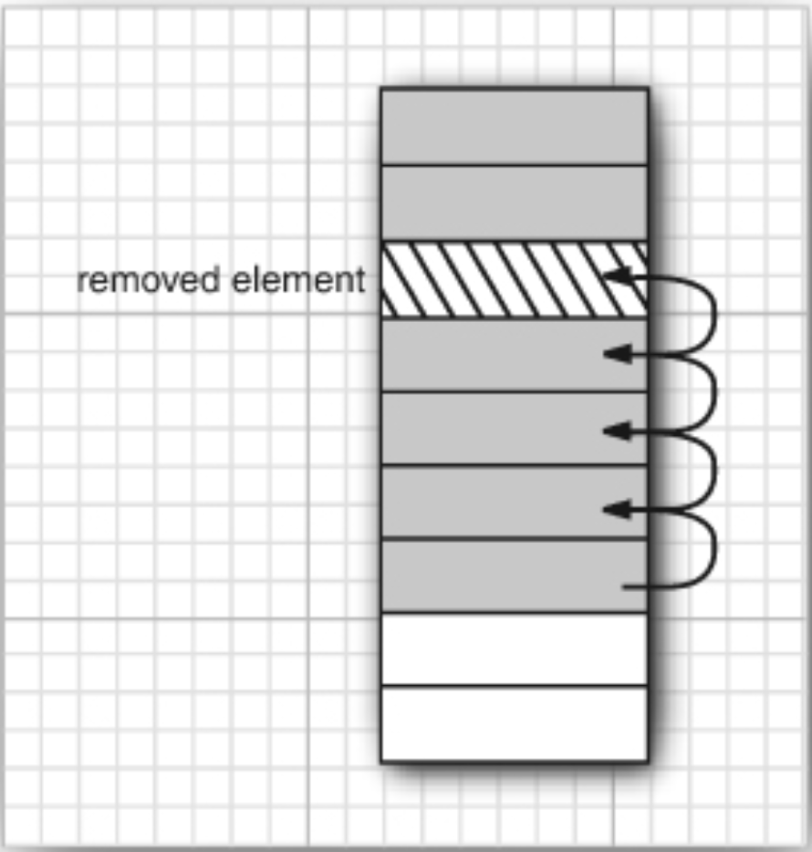
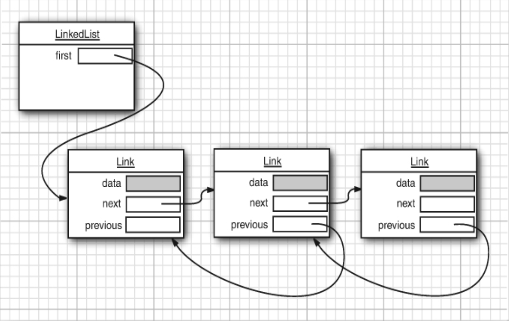

<!-- _class: lead -->

<!-- _header: M1 Informatique • Pré-rentrée 2022 • Programmation Java -->

## Chapitre 7
# Collections

<br>

Thibaud Martinez 
thibaud.martinez@dauphine.psl.eu

<!-- _footer:  -->

---

## Présentation

Une **collection** est un objet qui **regroupe plusieurs éléments en une seule unité**. Les collections sont utilisées pour stocker, récupérer, manipuler et communiquer des données agrégées. 

---

## Java Collections Framework

Le Java Collections Framework propose une architecture unifiée pour représenter et manipuler les collections.

Il contient :

* **des interfaces** → des types de données abstraits qui représentent des collections;

* **des implémentations** → les implémentations concrètes des interfaces.

* **des algorithmes** → ce sont les méthodes qui effectuent des calculs utiles, tels que la recherche et le tri, sur les objets qui mettent en œuvre les interfaces de collection.

---

## Pourquoi distinguer les interfaces de leur implémentation ?

Considérons pour l'exemple une interface `Queue` qui définit des méthodes pour :
* ajouter des éléments à l'arrière de la file (_tail_);
* retirer des éléments à l'avant de la file (_head_);
* déterminer combien d'éléments contient la file.

```java
public interface Queue<E> {
    void add(E element);
    E remove();
    int size();
}
```

---

<style scoped>
code {
    font-size: 0.8rem
}
</style>

Chaque implémentation est une classe qui implémente l'interface `Queue`.

```java
public class CircularArrayQueue<E> implements Queue<E> {
   private int head;
   private int tail;
   CircularArrayQueue(int capacity) { }
   void add(E element) { }
   public E remove() { }
   public int size() { }
   private E[] elements;
}
```

```java
public class LinkedListQueue<E> implements Queue<E> {
    private Link head;
    private Link tail;
    LinkedListQueue() { }
    public void add(E element) { }
    public E remove() { }
    public int size() { }
}
```

---

Lorsqu'on utilise une `Queue`, il n'est pas nécessaire de savoir quelle implémentation est utilisée une fois que la collection a été initialisée.

<br>

On utilisera le **type interface** pour faire référence à l'objet collection et le **type concret** pour initialiser l'objet.

```java
Queue<Client> fileDAttente = new CircularArrayQueue<>(100);
fileDAttente.add(new Client("Jean"));
```

→ **Si on change d'avis il est facile d'utiliser une implémentation différente**.

---

## Les interfaces dans la Collections Framework


<br>

Deux types d'interfaces fondamentales : les `Collections` et les `Map`.

---

## L'interface Collection

```java
public interface Collection<E>{
    boolean add(E element); 
    Iterator<E> iterator(); 
    ...
}
```

Possède deux méthodes fondamentales :
* `add`: ajoute un élément à la collection et renvoie `true` si l'ajout a changé la collection et `false` autrement;
* `iterator`: renvoie un objet qui implémente l'interface `Iterator`.

<!-- _footer: '[Collection](https://docs.oracle.com/javase/8/docs/api/java/util/Collection.html)' -->


---

## Les itérateurs (_Iterators_)

Un Iterator est un objet qui est utilisé pour **parcourir** des collections à l'aide d'une boucle.

```java
public interface Iterator<E>{
    E next();
    boolean hasNext();
    void remove();
    default void forEachRemaining(Consumer<? super E> action); 
}
```

---

## Utiliser un itérateur

```java
Collection<String> c = ...;
Iterator<String> iter = c.iterator();   

while (iter.hasNext()) {
    String element = iter.next(); 
    // fait quelque chose avec l'élément
}
```

On peut écrire la boucle de façon plus concise.

```java
for (String element: c) {
    // fait quelque chose avec l'élément
}
```

---

## Méthode utilitaires

L'interface `Collection` définit un certain nombre de méthodes utiles que la classe qui implémente l'interface doit fournir.

```java
int size()
boolean isEmpty()
boolean contains(Object obj)
boolean containsAll(Collection<?> c)
boolean equals(Object other)
boolean addAll(Collection<? extends E> from)
boolean remove(Object obj)
boolean removeAll(Collection<?> c)
void clear()
boolean retainAll(Collection<?> c)
Object[] toArray()
```

---

## _ArrayList_



La classe `ArrayList` décrit un tableau redimensionnable.

```java
List<String> voitures = new ArrayList<String>();
voitures.add("Clio");
voitures.add("Tesla Model S");
```

→ retirer un élément du milieu d'un tableau est coûteux car tous les éléments du tableau au-delà de celui qui a été retiré doivent être déplacés vers le début du tableau. Il en va de même pour l'insertion d'éléments au milieu.

---

<style scoped>
p {
    font-size: 0.9rem
}
</style>

## Liste chaînée (_LinkedList_)



* Une liste chaînée stocke chaque objet dans un **noeud** distinct. 

* Chaque noeud stocke une **référence au noeud suivant** dans la séquence.

* En Java, il s'agit de listes doublement chaînées, c'est-à-dire que chaque noeud stocke également une référence à son prédécesseur.

→ Il est rapide d'insérer ou de supprimer des données au milieu de la liste.

---

## Utilisation d'une liste chaînée

L'exemple de code suivant ajoute trois éléments, puis supprime le deuxième :

```java
List<String> personnes = new LinkedList<String>();
personnes.add("Steven");
personnes.add("Georges");
personnes.add("Francis");

Iterator<String> iter = personnes.iterator();
String premier = iter.next();   // consulte le premier élément
String second = iter.next();    // consulte le deuxième element
iter.remove();  // retire le dernier élément consulté
```

---

## _HashSet_

Un `HashSet` est une collection d'éléments où chaque élément est unique. Contrairement aux `List` un `Set` n'est pas ordonné.

```java
Set<String> voitures = new HashSet<String>();
voitures.add("Volvo");
voitures.add("BMW");
voitures.add("Volvo");

voitures.size();    // renvoie 2
voitures.contains("Renault"); // renvoie false
voitures.contains("Volvo");   // renvoie true
```

→ Les HashSet sont implémentées avec des tables de hachage (voir après). Il est rapide de vérifier si un objet appartient ou nom au `HashSet`.

---

## L'interface Map

Un tableau associatif ou _map_ stocke des **paires clé/valeur**. On y insère un élément à l'aide de sa clé. On peut trouver une valeur si on fournit la clé associée.

### Exemple

| Clé         | Valeur   |
|-------------|----------|
| "France"    | "Paris"  |
| "Allemagne" | "Berlin" |
| "Espagne"   | "Madrid" |
| "Italie"    | "Rome"   |

---

## HashMap

C'est une implémentation de l'interface `Map` basée sur une table de hachage.

```java
Map<String, String> capitales = new HashMap<String, String>();

capitales.put("France", "Paris");
capitales.put("Allemagne", "Berlin");
capitales.put("Espagne", "Madrid");

capitales.get("France");    // renvoie "Paris"
```

---

## Table de hachage (_hash table_)

